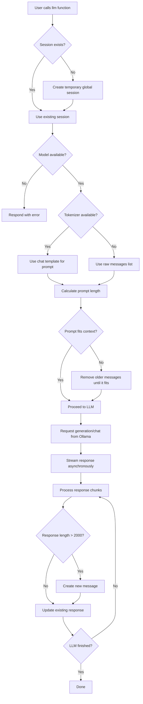

# steel-llama

My Discord bot (update of unreasonable-llama-discord for Ollama)

This bot is a bridge between Discord and Ollama, with it's own user and session management system.

## Features

- By default, the bot uses the recent chat history as context. Amount of messages stored in context depends on maximum context size and bot's configuration.
- Sessions are stored in bot's database and active session can be selected by the user via bot commands.
- Users can start their own, private sessions that contain only the conversation between them and the bot. Sessions are identified by IDs provided by the user.
- Sessions are bound to user ID
- Users can delete their private sessions (as whole)
- Users can select the model for each session. Default model is configured by bot's administrator.
- Users can set the system prompt for each session.

The bot uses local sqlite3 database to store the data.
Configuration is stored in configparser-compatible .ini file.

## Bot commands

Commands can be triggered by starting the message with bot's prefix, followed by command name and arguments.
For the sake of following examples, `$` is the bot's command prefix, and `@username` is the username.
Bot should respond to the message that triggered the command. If the command name is unknown, bot will not respond.

### Trigger bot response

```text
$llm what's the capital of Poland?
```

Example bot's response:

```text
The capital of Poland is Warsaw.
```

### Show bot's help

```text
$help
```

Bot's response:

```text
SteelLlamaCommands:
  llm                   Chat with the LLM
  llm-change-session    Switch to a different session.
  llm-get-session-size  Get the size of a saved session.
  llm-list-models       List all available models.
  llm-list-sessions     List all saved sessions.
  llm-new-session       Create a new private session.
  llm-remove-session    Remove a saved session.
  llm-set-session-model Set a model for the current session.
  llm-set-system-prompt Set a system prompt for the current session.
​No Category:
  help                  Shows this message

Type $help command for more info on a command.
You can also type $help category for more info on a category.
```

### Create new session

```text
$llm-new-session MyCustomSession
```

Bot's response:

```text
*Created and switched to MyCustomSession*
```

### List available sessions

```text
$llm-list-sessions
```

Bot's response:

```text
List of your sessions:
- MyCustomSession (model: SomeModel)
- OtherSession (model: SomeOtherModel)
```

### Change current session

```text
$llm-change-session OtherSession
```

Bot's response:

```text
Changed your session to OtherSession
```

To switch to global session, use `global` as the name. You cannot create a session with this name.

### Remove a session

```text
$llm-remove-session OtherSession
```

Bot's response:

```text
Removed session OtherSession
```

If current session is removed, bot will fallback to global session.
In that case, the response will be:

```text
Removed current session OtherSession, switching to global session.
```

### Check current session size

```text
$llm-get-session-size MyCustomSession
```

Bot's response:

```text
Session MyCustomSession currently contains 1024 tokens.
```

### Set system prompt for current session

```text
$llm-set-system-prompt You are a helpful assistant.
```

Bot's response:

```text
Changed system prompt for current session to `You are a helpful assistant.`
```

### List available models

```text
$llm-list-models
```

Bot's response:

```text
Available models:
- ModelAName - 8B parameters, Q6_K quantization
- ModelBName - 14B parameters, Q4_K_XL quantization
- ModelCName - 4B parameters, Q8_0 quantization
```

Models must be defined in configuration file, see [Configuration file](#configuration-file) section.

### Set model for a session

```text
$llm-set-session-model MyCustomSession ModelCName
```

Bot's response:

```text
Changed model for session MyCustomSession to ModelCName (4B parameters, Q8_0 quantization)
```

Model for global session is stored in bot's [configuration file](#configuration-file).

## Configuration file

```ini
[models]
# The model to use by default
default_model = qwen3-8b
# the default model tag to use, if user doesn't specify one
default_model_tag = latest

[admin]
# Discord ID of administrator's account.
id = 12345

[bot]
# Discord API key for the bot
discord_api_key = your_discord_api_key_here
# Prefix for bot commands
bot_prefix = $
# Delay in seconds between message edits
edit_delay_seconds = 0.5
# Maximum number of messages to use for context
max_messages_for_context = 30
# Path to sessions database
session_db_path = ./bot.db
# Default system prompt for all sessions
default_system_prompt = You are SteelLlama, an LLM-powered Discord bot, proceed with the following conversation with the users. Every message is prefixed with a line containing the username of sender (prefixed with @). DO NOT add that prefix to your messages, use it only to identify the authors. Messages directed specifically to you are prefixed with "$llm".

# Every supported model must have a section in configuration (with full model name, including tag)
[models.qwen3-8b:latest]
# Optional prefix and suffix for thinking indicator (used for models like qwen3)
thinking_prefix = "<think>"
thinking_suffix = "</think>"
# Best to provide name/path to `transformers`-compatible tokenizer for precise token counting
tokenizer = Qwen/Qwen3-8B 
# Context limit is optional, by default the one reported by ollama is used
context_limit = 65536
```

## Operations

This section contains information about internal workings of the bot, for documentation and vibecoding purposes.

### Prompt processing

When the user calls `llm` function of the bot, the bot starts with looking for current session for the user.
If there's no entry in persistent database that specifies the user has a private session enabled, temporary global session is created.
Temporary session contains last X messages (the amount can be specified in config and it does not count the prompt message itself) from the channel user requests response in.

The bot also verifies that the model used for response is available. If it's not, it will respond with an error instead of proceeding.

After creating the session, one of two things can happen.
If the current model has tokenizer specified, and the tokenizer contains chat template, it's used to create a prompt for ollama's `generate` endpoint, and it's length (in tokens) is calculated.
If it doesn't, raw list of messages is used with ollama's `chat` endpoint, and prompt length is estimated based on the length of each message.

Then, prompt length is compared to model's context length.
If it's too long, the bot will calculate the length (in tokens) of each message in session and try to create a prompt that fits the context by removing older messages until it fits.
If it's not possible (user's prompt itself is too long for context), the bot will respond with an error instead of proceeding.

After constructing a valid prompt or list of messages, the generation/chat is requested and we go into [LLM response processing](#llm-response-processing)

### LLM response processing

The output of an LLM is asynchronously streamed into a string.
That string is then processed into a proper LLM message in progressive fashion (each chunk is added to existing message instead of re-processing it each time). Every Y seconds (the interval can be specified in configuration file), bot's Discord response is updated with the content of LLM's message.

Discord has a 2000-character limit for text messages. In order to make sure the LLM response is sent correctly, and won't throw an error when it reaches that limit, the response length is calculated before each Discord response update.
If the length of the response is above 2000 characters, bot will stop updating the existing response and will create a new one (as a new response to the existing one), and continue editing it until it hits 2000 characters, in which case it will repeat this process until the LLM finishes generation.


